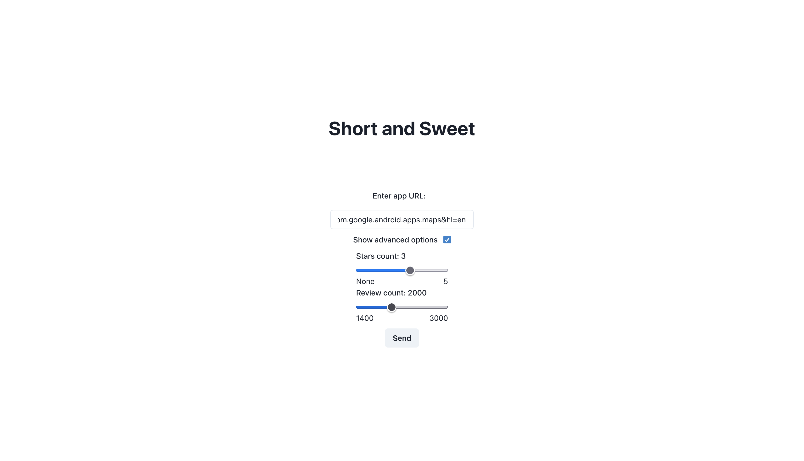
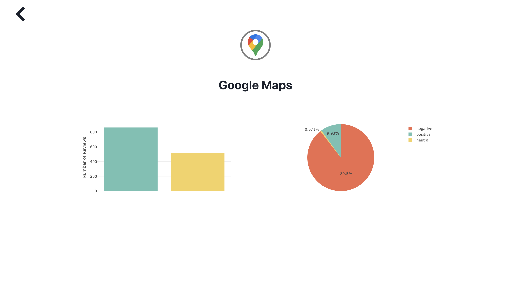
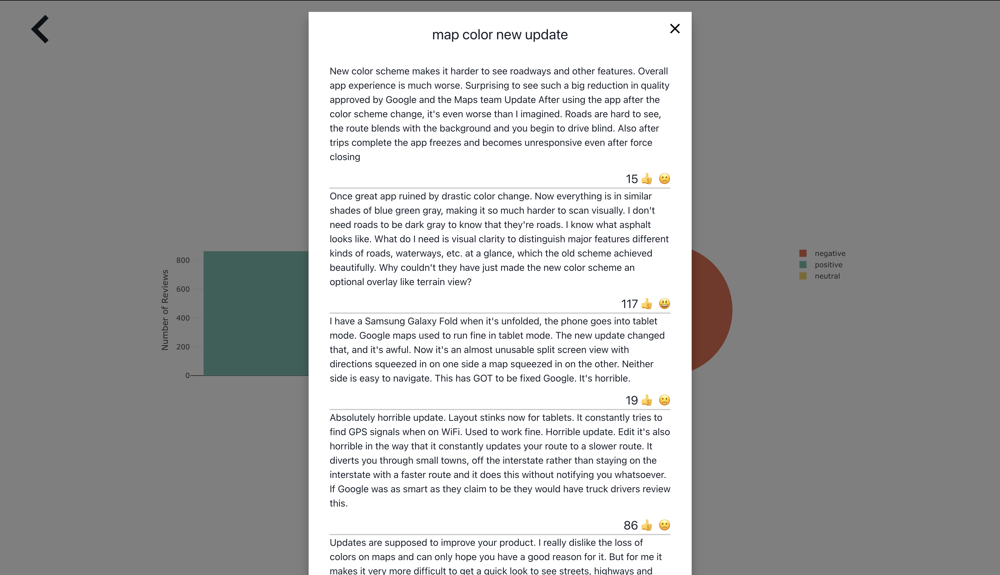

# Short and Sweet

Comprehensive Approach for Summing up Application’s Reviews using NLP

## About

Short and sweet is a web app that uses machine learning methods to summarize themes that run thrugh various reviews of a given app on a Google Play Store. Application displays these captured themes in a form of bar plots, additionally sentiments of a reviews are also captured and displayed in a form of pie plots.

## Usage

1. Start the application by using running `docker-compose up` command in the `/src` directory

2. Go to the [http://0.0.0.0:3000](http://0.0.0.0:3000) address on your browser.

3. Paste URL of an application from a [Google Play Store's website](https://play.google.com/store/games?hl=en) into the form field.


4. Add additional scrapping parameters like review count or star filter.



5. View the results, and get more information by hovering over the plots and clicking on the bar plot.






## Setup 

The whole short and sweet app runs in the docker container, thanks to this solution the instalation of dependencies will be seemless. The docker conainers running machine learning models are run on CPU's (Nvidia docker images are planned to be implemented). Because of this a beefy CPU's are needed, AMD Ryzen 5 6-Core does the job in my case. However if you don't have a beefy CPU an instruction of deloying machine learning endpoints to [GCP](https://cloud.google.com/gcp)


1. Clone this repository code.

```sh
git clone git@github.com:bjpietrzak/short_and_sweet.git
```

2. Enter projects src directory.

```sh
cd short_and_sweet/src/
```

3. Run `docker-compose build` which will downlad all the dependencies to run this project.

```sh
docker-compose build
```

## Local

1. When running the app locally, all you have to do is go to the `short_and_sweet/src` directory and run the command

```sh
docker-compose up
```


## Cloud

If you don't have sufficient CPU locally you can deploy machine learning endpoints.