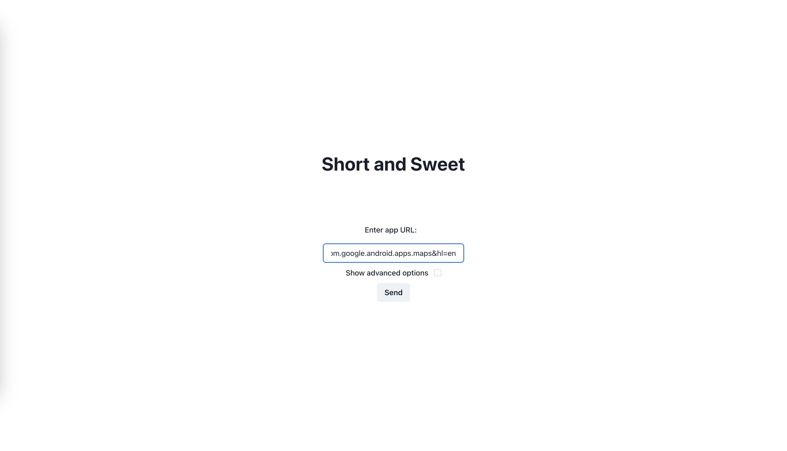

# Short and Sweet: Summarize App Reviews with NLP

## About

Short and Sweet is a web application that utilizes machine learning techniques to summarize recurring themes in reviews from the Google Play Store. It presents these themes in bar plots and sentiments of the reviews in pie charts.

## Usage

1. **Start the Application**: In the `/src` directory, run `docker-compose up`.

2. **Access the Web Interface**: Visit [http://0.0.0.0:3000](http://0.0.0.0:3000) in your browser.

3. **Enter App URL**: Paste the URL of a Google Play Store app into the form field.

   

4. **Set Scraping Parameters**: Choose review count and star filter options.

   

5. **View Results**: Interact with the plots for detailed insights.

   
   

## Setup

The application runs in a Docker container, simplifying dependency installation. The machine learning models run on CPUs, requiring powerful hardware (e.g., AMD Ryzen 5 6-Core). For less powerful systems, see the cloud deployment instructions.

### Local Setup

1. **Clone the Repository**:

```sh
git clone git@github.com:bjpietrzak/short_and_sweet.git
```
2. **Navigate to the Project Directory**:
```sh
cd short_and_sweet/src/
```
3. **Build the Docker Images**:
```sh
docker-compose build
```
### Cloud Deployment

Lacking a powerful CPU? Deploy the machine learning models on Google Cloud Platform (GCP).

1. **Create a GCP Account**: [Sign up for GCP](https://cloud.google.com/gcp).
2. **Set Up a GCP Project**: [Create a new project](https://console.cloud.google.com/projectcreate) and note the project ID.
3. **Enable Services**: Activate [Container Registry](https://console.cloud.google.com/marketplace/product/google-cloud-platform/container-registry), [Cloud Build](https://cloud.google.com/build), and [Cloud Run](https://cloud.google.com/run).
4. **Install gcloud CLI**: [Download here](https://cloud.google.com/sdk/docs/install).
5. **Configure gcloud**:
```sh
gcloud config set project <project-ID>
```
6. **Build and Deploy Models**: In `src/ai/bertopic` or `src/ai/distillbert`, run:
```sh
gcloud builds submit --tag gcr.io/<project-ID>/inference
```
and
```sh
gcloud run deploy inference --image=gcr.io/<project-ID>/inference:latest --execution-environment=gen2 --region=<region> --project=<project-ID> && gcloud run services update-traffic inference --to-latest
```
7. **Update Endpoints**: Insert the URL from Cloud Run into `src/backend/app/configs/endpoints.json`.
8. **Comment Out Local AI Services** in `src/docker-compose.yaml`.
9. **Launch the Application**:
```sh
docker-compose up
```
## Common Errors and Solutions

Here are common errors you might encounter and how to resolve them.

### 1. Time Out During Cloud Run Deployment

**Problem**: Deploying the Docker image to the Cloud Run service times out, possibly due to insufficient memory allocation.

**Solution**:
- **Increase Memory Allocation**: Navigate to the [Container Registry](https://console.cloud.google.com/gcr/images/), select the Docker image you wish to deploy. In the deployment settings, allocate more memory to the container. Setting it to 8GB RAM can be effective.

  **Steps**:
  1. Go to the Container Registry and select your image.
  2. During deployment, adjust the memory settings to 8GB.
  
        

- **Redeploy**: After adjusting the memory settings, redeploy the image to Cloud Run.

   *<-- Placeholder for a screenshot of the redeployment process.*

### 2. Time Out During Inference

**Problem**: Experiencing a timeout during the inference phase of the project.

**Solution**:
1. **Increase Backend Timeout Threshold**: Edit the `timeout` value in the `src/backend/app/configs/backend.json` file. Increasing this value allows more time for the inference process to complete without timing out.

    **Modification Example**:
    ```json
    "timeout": 420
    ```
2. **Increase Cloud Run Endpoint Timeout**: In the deployment settings of the Cloud Run service, increase the timeout value to allow more time for inference operations.

    